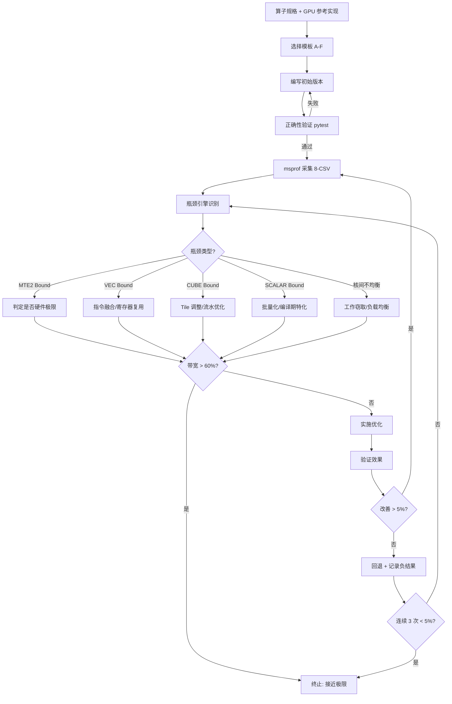

# 第 1 篇：TileLang 算子开发与优化方法论（总体）

> **定位**：高层概览，建立心智模型。不深入 API 细节，仅给出概念框架和流程骨架。
>
> **知识边界**：
> - ✅ 本篇讲：为什么需要 TileLang、瓶颈驱动流程骨架、策略表分类框架、黄金法则、案例速览
> - ❌ 本篇不讲：API 签名（→ 第 2 篇）、Pass 原理（→ 第 3 篇）、策略细节（→ 第 5 篇）、msprof 命令（→ 第 6 篇）
>
> **前置**：无　**后续**：第 2 篇展开编程模型，第 3 篇展开编译后端

---

## 1.0 开篇：为什么需要 TileLang

### 1.0.1 AI 硬件多元化趋势

大模型训练与推理的算力需求呈指数级增长，硬件生态正在经历深刻变革：

```
2020-2022: GPU 绝对主导 (CUDA 生态)
    ↓
2023-2024: NPU 崛起 (华为 Ascend / 寒武纪 / 景嘉微)
    ↓
2025+:     多芯片并存 (GPU + NPU + 国产芯片 + 自研 ASIC)
```

这一趋势带来了一个核心工程挑战：**同一套算子逻辑，需要高效运行在架构截然不同的硬件上**。

### 1.0.2 算子开发痛点

在 TileLang 出现之前，NPU 算子开发面临三大痛点：

| 痛点 | 具体表现 | 后果 |
|------|---------|------|
| **手写 AscendC 门槛高** | 需理解 UB/L1/L0A/L0B/L0C 六级内存、MTE2/MTE3/Cube/Vector/FixPipe 五类引擎、NZ 布局约束 | 开发周期长（单算子数天~数周），人才稀缺 |
| **跨平台迁移成本大** | CUDA kernel 和 AscendC kernel 完全不同的编程模型，无法复用 | 同一算子需维护 N 份代码 |
| **性能调优无方法论** | 靠经验试参（num_stages / tile_size / group_size），缺乏瓶颈定位→策略选择的系统方法 | 调优效率低，性能不可预测 |

### 1.0.3 TileLang 的定位

**TileLang** 是 TVM 生态中的 **Tile-Level DSL**（领域特定语言），核心设计理念：

```
┌─────────────────────────────────────────────────────────┐
│                   TileLang DSL (Python)                  │
│  @tilelang.jit                                          │
│  def kernel(M, N, K, dtype):                            │
│      with T.Kernel(num_cores) as pid:                   │
│          shared = T.alloc_shared((BM, BK), dtype)       │
│          T.copy(gm_a[pid*BM:], shared)                  │
│          ...                                             │
│      return kernel                                      │
└──────────────────────┬──────────────────────────────────┘
                       │ 统一 IR (TVM TIR)
┌──────────────────────▼──────────────────────────────────┐
│              TVM IR → Pass Pipeline                      │
│  通用 Pass + 后端专用 Pass (Ascend / CUDA / ROCm / ...)  │
└──────────────────────┬──────────────────────────────────┘
                       │ Codegen
┌──────────┬───────────┼───────────┬──────────────────────┐
│  CUDA    │  Ascend   │  ROCm     │  Metal / CPU / ...   │
│  (nvcc)  │ (bisheng) │ (hipcc)   │                      │
└──────────┴───────────┴───────────┴──────────────────────┘
```

**核心价值**：
1. **一套代码多后端**：同一份 Python DSL 编译到 CUDA / Ascend / ROCm / Metal
2. **Tile-Level 抽象**：开发者只需描述 tile 级计算，后端自动 lowering 到硬件指令
3. **Z3 Auto-Schedule**：Ascend 后端用 Z3 SMT 求解器自动优化流水线调度
4. **性能可预测**：瓶颈驱动方法论 + msprof 诊断 + 策略表 = 系统化调优

### 1.0.4 本系列目标读者

- 有 CUDA / Triton 经验，需要为 NPU 开发高性能算子的工程师
- 了解 TVM / 编译器基础概念（IR / Pass / Codegen）的工程师
- 希望系统化掌握 NPU 算子优化方法论的技术人员

### 1.0.5 TileLang 的核心优势总结

| 维度 | 传统 AscendC | TileLang |
|------|-------------|---------|
| 编程抽象 | 汇编级 intrinsics | Python Tile-Level DSL |
| 跨平台 | 仅 Ascend | CUDA / Ascend / ROCm / Metal |
| 内存管理 | 手动 UB/L1 分配 | `T.alloc_shared` / `T.alloc_l1` 声明式 |
| 流水调度 | 手动 set_flag/wait_flag | `num_stages` 参数 + Z3 auto-schedule |
| 向量计算 | 手写 SIMD intrinsics | `T.SimdVF` + `simd` MicroAPI |
| 调试 | printf / msprof 手动 | `TL_ENABLE_DUMP_IR` + JIT 调试 |
| 生态 | 封闭 | TVM 生态 + vllm / torchtitan 集成 |

---

## 1.1 瓶颈驱动优化流程（核心方法论）

### 1.1.1 核心原则

> **不盲目调参，先定位瓶颈再针对性优化。**

这是 TileLang 算子优化的第一原则。传统"经验试参"方式（随机尝试 num_stages=2/3/4、tile_size=128/256）效率极低，且无法解释为什么某个参数有效。

瓶颈驱动方式的核心逻辑：

```
性能问题 → 定位瓶颈引擎 → 查策略表选方案 → 实施优化 → 验证效果
    ↑                                                    |
    └────────────────────────────────────────────────────┘
                         闭环迭代
```

### 1.1.2 五步闭环

```
┌──────────────┐    ┌──────────────┐    ┌──────────────┐
│ ① msprof 采集 │──→│ ② 识别瓶颈引擎│──→│ ③ 查表选策略  │
└──────────────┘    └──────────────┘    └──────────────┘
                                              │
┌──────────────┐    ┌──────────────┐         │
│ ⑤ 验证闭环   │←──│ ④ 实施优化   │←────────┘
└──────────────┘    └──────────────┘
```

| 步骤 | 内容 | 输入 | 输出 |
|------|------|------|------|
| ① msprof 采集 | 用 msprof 工具采集算子性能数据 | 编译好的 kernel + 测试数据 | 8 个 CSV + PipeTimeline |
| ② 识别瓶颈引擎 | 分析 8-CSV，定位主导引擎和等待比例 | 8 个 CSV | 瓶颈类型（MTE2/VEC/CUBE/SCALAR...） |
| ③ 查表选策略 | 根据瓶颈类型查策略表，选择优化方向 | 瓶颈类型 + 策略表 | 具体优化方案（API 修改 + 参数调整） |
| ④ 实施优化 | 修改 TileLang 源码，应用优化方案 | 优化方案 | 新版 kernel |
| ⑤ 验证闭环 | 重新采集 msprof，对比前后性能 | 新版 kernel | 性能对比 + 决策（继续/终止） |

### 1.1.3 扩展为 10 步 Agent 自动化闭环

上述五步闭环在 Agent 自动化场景下扩展为 10 步（→ 详见第 6 篇 § 6.2）：

| 步骤 | 五步闭环映射 | 内容 | 工具 |
|------|------------|------|------|
| ① 分析算子规格 | — | 语义/shape/dtype/访问模式 → 选模板 | LLM |
| ② 编写初始版本 | — | 设 pass_configs、tiling、执行模型 | LLM |
| ③ 正确性验证 | — | pytest allclose | ssh_remote.py |
| ④ 准备 profiling 入口 | — | 生成独立 profiling_file | LLM |
| ⑤ msprof op 采集 | ① msprof 采集 | 普通采集 + PipeTimeline 采集 | msprof |
| ⑥ 归档 + 摘要 | — | perf_summary.py 生成 summary.txt | perf_summary.py |
| ⑦ 性能标准判定 | ② 识别瓶颈 | 8-CSV 联合诊断 | LLM |
| ⑧ 瓶颈定位优化 | ③ 查表选策略 | 查 optimization_quickref.md | LLM |
| ⑨ 验证优化效果 | ④⑤ 实施验证 | 对比 round_NNN | diff |
| ⑩ 生成 HTML 报告 | — | 前后对比 + 负结果记录 | report.py |

### 1.1.4 迭代终止条件

优化不是无限迭代的。满足以下**任一**条件即应终止：

| 终止条件 | 含义 | 典型场景 |
|---------|------|---------|
| 带宽 > 60% | 已接近硬件极限 | MTE2 bound 的搬运密集型算子 |
| 实际 vs 理论差距 < 20% | 已接近理论最优 | 计算密集型算子 |
| 连续 3 次 < 5% 改善 | 边际收益递减 | 已过主要优化点 |
| 编译失败 | 参数不合法 | 回退该参数，尝试其他方向 |

### 1.1.5 瓶颈驱动闭环流程图



---

## 1.2 瓶颈引擎识别策略表（框架概览）

> 本节仅给出策略分类框架。每类策略的具体实施步骤、代码示例和实测对比 → 详见第 5 篇。

### 1.2.1 NPU 五类执行引擎

理解瓶颈驱动优化，首先需要理解 NPU 的五类执行引擎及其并行关系：

```
┌──────────────────────────────────────────────────────────┐
│                    NPU AI Core 架构                       │
│                                                          │
│  ┌─────────┐  ┌─────────┐  ┌─────────┐  ┌─────────┐    │
│  │  MTE2   │  │  MTE3   │  │  Cube   │  │ Vector  │    │
│  │ (GM→UB) │  │ (UB→GM) │  │ (GEMM)  │  │ (SIMD)  │    │
│  └─────────┘  └─────────┘  └─────────┘  └─────────┘    │
│        ↕  并行执行  ↕         ↕  并行执行  ↕            │
│  ┌─────────┐                                            │
│  │ Scalar  │  (标量处理，地址计算/循环控制)              │
│  └─────────┘                                            │
└──────────────────────────────────────────────────────────┘
```

**关键特性**：MTE2（读 DMA）、MTE3（写 DMA）、Cube（GEMM）、Vector（SIMD）、Scalar **五类引擎可并行执行**。`num_stages` 流水的本质就是让 MTE2 读下一帧时，Vector/Cube 计算当前帧，MTE3 写上一帧。

> msprof 中各引擎 ratio 之和可 > 100%，表示流水重叠生效。反之，若 `vec + scalar + mte2 + mte3 ≈ 100%`，说明完全串行，需要上双缓冲。

### 1.2.2 九类瓶颈 × 策略概览

| 瓶颈类型 | msprof 判定指标 | 策略方向 | 详解引用 |
|---------|----------------|---------|---------|
| **Vector 标量读** | `aiv_vec_ratio` 最高，标量 GM 访问多 | T.copy DMA 替换标量读 | → 第 5 篇 § 5.2 |
| **Scalar 循环开销** | `aiv_scalar_ratio` > 30% | 批量化 + 编译期特化 | → 第 5 篇 § 5.2 |
| **MTE2 带宽极限** | `aiv_mte2_ratio` > 95% + `mte2_wait` > 95% | 判定硬件极限，停止优化 | → 第 5 篇 § 5.8 |
| **MTE2/MTE3 未重叠** | `mte2_wait` 高，ratio 和 ≈ 100% | `num_stages` 流水 | → 第 5 篇 § 5.5 |
| **核间负载不均衡** | 各核 `Task Duration` 差异 > 10% | `T.Persistent` 工作窃取 | → 第 5 篇 § 5.5 |
| **元数据反复 GM 访问** | `L2 hit rate` < 50% | 批量 T.copy 预加载 + L2 策略 | → 第 5 篇 § 5.3 |
| **嵌套串行循环** | `vec_ratio` 中等，循环层数多 | SimtVF 展平 1D | → 第 5 篇 § 5.2 |
| **GEMM Cube 未饱和** | `aic_cube_ratio` 低 | 增大 TILE_K + aswt_swizzle | → 第 5 篇 § 5.3-5.4 |
| **FixPipe 与 GEMM 未重叠** | `fixpipe_ratio` > 15% | `unit_flag_ctrl` 重叠 | → 第 5 篇 § 5.4 |

### 1.2.3 交叉关联诊断

单一指标往往不足以定位根因，需要交叉关联多个 CSV：

| 现象组合 | 根因假设 | 优先检查 |
|---------|---------|---------|
| 高 `vec_ratio` + 高 bank conflict | UB 布局放大 Vector 耗时 | `T.alloc_shared` shape/padding |
| 高 `mte2_ratio` + 低 L2 hit rate | 数据复用或 L2 策略不合理 | Tile 调度、`l2_cache_ctrl` |
| 高 `fixpipe_ratio` | 输出路径或地址对齐低效 | 输出 Tile、`T.dual_copy` 路径 |
| 高 `mte2` + 高 `mte3` | GM 双向搬运饱和 | 融合中间结果、增大 Tile |
| 低 Block Dim + 高 Duration | 并行 Tile 数或 block 不足 | `T.Kernel` block 数、Tile shape |
| `scalar` 高 + 小 shape | 动态控制和启动占比高 | 编译期特化、减少 `T.serial` |

### 1.2.4 不同算子类型的预期 ratio 分布

不同类型的算子，其合理的引擎占比分布不同。偏离预期分布即为异常信号：

| 算子类型 | 主导流水 | 预期 ratio | 异常信号 |
|---------|---------|-----------|---------|
| Elementwise（Add/Mul/Relu） | VEC | `vec_ratio` 50-80% | MTE2 > VEC |
| Reduction（ReduceSum/Max） | VEC | `vec_ratio` 40-70% | `scalar` > 20% |
| Activation（Softmax/Gelu） | VEC | `vec_ratio` 60-85% | 大量 cast |
| MatMul | CUBE | `cube_ratio` 40-70% | `vec` > `cube` |
| 纯搬运（Transpose/Concat） | MTE2/MTE3 | `mte2+mte3` > 50% | VEC > 30% |

> **注**：表中提到的 T.copy / SimdVF / num_stages / aswt_swizzle 等 API → 详见第 2 篇

### 1.2.5 九类策略对比矩阵

下表从**适用场景、预期收益、实施难度、风险**四个维度对比九类策略，帮助快速决策：

| 策略类型 | 适用场景 | 预期收益 | 实施难度 | 风险 | 典型耗时 |
|---------|---------|---------|---------|------|---------|
| **T.copy DMA 替换** | 标量 GM 读，vec_ratio 高 | 2-5x | 低（改 1-2 行） | 极低 | 0.5h |
| **批量化 + 编译期特化** | scalar_ratio > 30%，小 shape | 1.3-2x | 低（调 tile 参数） | 低 | 0.5h |
| **num_stages 流水** | mte2/vec 串行，ratio 和 ≈ 100% | 1.2-1.5x | 中（需验 UB 容量） | UB 超容 | 1h |
| **T.Persistent 工作窃取** | 核间差异 > 10% | 1.1-1.3x | 中（改调度模式） | 低 | 1h |
| **L2 缓存策略** | L2 hit rate < 50% | 1.1-1.3x | 中（选 l2_cache_ctrl） | 低 | 0.5h |
| **SimtVF 展平 1D** | 嵌套串行循环多 | 1.5-3x | 中（重构循环） | 中 | 2h |
| **TILE_K + aswt_swizzle** | cube_ratio 低，GEMM 类 | 1.2-1.5x | 高（调 swizzle 参数） | 中 | 2h |
| **unit_flag_ctrl 重叠** | fixpipe_ratio > 15% | 1.1-1.2x | 高（需理解 flag 语义） | 高 | 3h |
| **判定硬件极限** | mte2_ratio > 95% | 0（终止优化） | 低（仅判定） | 无 | 0.5h |

### 1.2.6 常见算子优化路径速查

不同算子类型有典型的优化路径。以下是基于大量实践总结的**一键速查表**：

| 算子类型 | 初始瓶颈 | 优化路径 | 典型收益 | 终止瓶颈 |
|---------|---------|---------|---------|---------|
| **Gather (小 D≤128)** | Scalar 标量读 | DMA 替换 → 批量化 BM → num_stages=4 | 3.4x | T.copy 行开销 |
| **Gather (大 D≥4096)** | MTE2 随机读 | DMA 替换 → num_stages=4 → 判定极限 | 1.5-2x | MTE2 硬件极限 (67-73%) |
| **RMSNorm** | VEC 标量读 | Fragment trick → 64 cores → UB merge | 1.37x | MTE2 带宽 88% |
| **per_token_cast** | MTE2 + VEC 双高 | vld2 融合 → num_stages → PassConfig → vand 替代 vabs | 1.34x | MTE2 硬件极限 (66%) |
| **GEMM (bf16)** | Cube 未饱和 | TILE_K=256 → aswt_swizzle → unit_flag_ctrl | 1.2-1.5x | Cube 80%+ |
| **Flash Attention** | 双 GEMM + softmax | online softmax → 双缓冲 → SimdVF 融合 | 1.3x | Cube + MTE2 |
| **RoPE** | VEC 标量读 | T.copy DMA → SimtVF 展平 | 1.54x | MTE2 带宽 72% |
| **Softmax** | VEC + 归约 | online softmax → num_stages → UB merge | 1.63x | MTE2 带宽 82% |

### 1.2.7 策略选择决策流程

```
msprof 采集完成
    ↓
读取 PipeUtilization.csv
    ↓
┌─ mte2_ratio > 95% 且 mte2_wait > 95%?
│   └─ 是 → 判定硬件极限，终止优化
│
├─ scalar_ratio > 30%?
│   └─ 是 → 批量化 + 编译期特化（优先）
│
├─ vec_ratio 最高 且有标量 GM 读?
│   └─ 是 → T.copy DMA 替换（优先）
│
├─ ratio 和 ≈ 100%（串行）?
│   └─ 是 → num_stages 流水
│
├─ 核间差异 > 10%?
│   └─ 是 → T.Persistent 工作窃取
│
├─ L2 hit rate < 50%?
│   └─ 是 → L2 缓存策略
│
├─ fixpipe_ratio > 15%?
│   └─ 是 → unit_flag_ctrl 重叠
│
└─ cube_ratio 低?
    └─ 是 → TILE_K 增大 + aswt_swizzle
```

---

## 1.3 msprof 采集与 8-CSV 联合诊断（概念说明）

> 本节介绍 8-CSV 的分析目标和分析顺序。具体采集命令、脚本使用和实操流程 → 详见第 6 篇 § 6.3-6.4。

### 1.3.1 msprof 工具简介

**msprof** 是 Ascend NPU 的性能分析工具，类似 CUDA 的 nsight compute / nvprof。采集后生成一组 CSV 文件，用于诊断算子性能瓶颈。

两种采集模式：
- **普通采集**：生成 8 个 CSV，用于瓶颈定位
- **PipeTimeline 采集**：额外生成流水线时序数据，用于分析流水气泡和重叠

### 1.3.2 8-CSV 固定读取顺序

Agent 按**固定顺序**读取 8 个 CSV，逐步缩小瓶颈范围：

| 顺序 | CSV 文件 | 分析目标 | 关键字段 |
|------|---------|---------|---------|
| 1 | `OpBasicInfo.csv` | 校验 kernel 名/频率/Task Duration | Task Duration, Block Dim |
| 2 | `PipeUtilization.csv` | 主导流水/核间差异 | aiv_vec_ratio, aiv_mte2_ratio, aic_cube_ratio |
| 3 | `ArithmeticUtilization.csv` | 有效计算/指令结构 | cube_fp16_ratio, vector_fma_ratio |
| 4 | `Memory.csv` | 总搬运量/带宽利用率 | GM_to_UB, UB_to_GM, bandwidth_util |
| 5 | `MemoryL0.csv` | CUBE L0A/L0B/L0C 带宽 | L0A/L0B read, L0C write |
| 6 | `MemoryUB.csv` | Vector UB 读写带宽 | UB read/write bandwidth |
| 7 | `L2Cache.csv` | 缓存命中假设验证 | total_hit_rate, miss_rate |
| 8 | `ResourceConflictRatio.csv` | Bank conflict/等待比例 | vec_total_cflt_ratio, mte2_wait_ratio |

### 1.3.3 带宽利用率基准

| 带宽利用率 | 判定 | 动作 |
|-----------|------|------|
| > 60% | 接近极限 | 考虑终止优化 |
| 30-60% | 有优化空间 | 继续瓶颈分析 |
| < 30% | 严重未利用 | 必须优化 |

### 1.3.4 各指标达标标准

| 指标 | 达标 | 警告 | 严重问题 |
|------|------|------|---------|
| 核间负载均衡 | 各核差异 < 10% | 10-30% | > 30% |
| Block Dim | 等于可用核数 | 远小于核数 | = 1 |
| VEC ratio | 与算子类型匹配 | > 80% | > 90% 且无优化空间 |
| MTE2 ratio | < 30%（计算型） | 30-50% | > 50% |
| fixpipe ratio | < 5% | 5-15% | > 15% |
| icache miss rate | < 5% | 5-15% | > 15% |
| bank conflict | < 5% | 5-15% | > 15% |
| L2 Cache 命中率 | > 80% | 50-80% | < 50% |
| 头开销占比 | < 10% | 10-30% | > 30% |
| DoubleBuffer 重叠 | MTE2/VEC 重叠 > 30% | 10-30% | < 5% |
| 带宽利用率 | > 60% | 30-60% | < 30% |

### 1.3.5 理论耗时计算

优化前必须计算**理论最优耗时**，作为优化目标：

```python
# 搬运理论耗时
理论耗时(us) = 实际搬运数据量(Byte) / GM 峰值带宽
# Ascend 950B: GM 峰值带宽 ≈ 4 TB/s = 4000 GB/s

# 计算理论耗时
理论耗时(us) = 实际计算量(FLOP) / 对应单元理论算力
# Ascend 950B:
#   cube_fp16_bf16: 432 TFLOPS
#   cube_fp32:      26 TFLOPS
#   cube_int8_fp8:  864 TOPS
#   vector_fp32_add:    13.5 TFLOPS
#   vector_fp16_bf16_fma: 54 TFLOPS
```

**性能判定流程**：

```
核算实际搬运数据量 + 实际运算数据量
    ↓
计算理论耗时（搬运量/带宽 或 计算量/算力）
    ↓
比较实际耗时 vs 理论耗时
    ├── 差距 < 20% → 性能达标（接近硬件极限）
    ├── 差距 20-50% → 有优化空间，查阅瓶颈优化表
    └── 差距 > 50% → 严重瓶颈，必须优化
```

### 1.3.6 PipeTimeline 流水气泡分析

PipeTimeline 数据用于分析流水线的重叠和气泡：

```
时间轴:  ──────────────────────────────────────→

MTE2:    [读 frame 1] [读 frame 2] [读 frame 3]
VEC:           [算 frame 1] [算 frame 2] [算 frame 3]
MTE3:                 [写 frame 1] [写 frame 2] [写 frame 3]

气泡率 = 流水空闲时间 / 关键路径时间
重叠率 = 两流水重叠时间 / 较短流水活跃时间
```

**流水重叠快捷判据**：`vec + scalar + mte2 + mte3` 四个 ratio 加起来 ≈ 100% 说明完全串行、该上双缓冲；加到 130% 以上才算真重叠。

> **第 9 步**：结论映射到 TileLang 具体修改（API → 第 2 篇，pass → 第 3 篇，策略 → 第 5 篇）

---

## 1.4 优化闭环验证方法

### 1.4.1 对比两轮摘要

每次优化后，重新运行 msprof 采集并生成 `summary.txt`，对比前后两轮：

```bash
diff <variant>/docs/perf/round_001/summary.txt \
     <variant>/docs/perf/round_002/summary.txt
```

**对比要点**：
1. Task Duration 是否下降
2. 瓶颈单元的 ratio 是否改善
3. 核间均衡是否改善（aiv_time min/max 差距）
4. 是否引入新的瓶颈

### 1.4.2 每次只改一个主要变量

**控制变量法**是优化验证的核心原则：

- 相同 `cases.csv`（测试场景不变）
- 相同 kernel 过滤规则（确保对比同一 kernel）
- 相同计时口径（稳态取值，排除冷启动）
- **每次只改一个主要参数**（如只改 `num_stages`，不改 `tile_size`）

违反此原则会导致无法归因——不知道性能变化是由哪个改动引起的。

### 1.4.3 五条黄金法则

这五条法则是 TileLang NPU 算子优化的经验总结，贯穿所有优化决策：

| 法则 | 含义 | 对应 API | 详解 |
|------|------|---------|------|
| **DMA 优先** | 用 T.copy DMA 替代标量 GM 访问 | `T.copy` | → 第 5 篇 § 5.2-5.3 |
| **批量摊薄** | 批量处理摊薄标量/循环开销 | `BM` / `BD` tiling | → 第 5 篇 § 5.2 |
| **流水重叠** | 多缓冲让 MTE2/VEC/MTE3 并行 | `num_stages` | → 第 5 篇 § 5.5 |
| **引擎匹配** | 计算类型用对应引擎（GEMM→Cube, SIMD→Vector） | `T.gemm` / `T.SimdVF` | → 第 5 篇 § 5.4 |
| **寄存器复用** | 中间值留 fragment/reducer，避免 UB 往返 | `alloc_fragment` / `alloc_reducer` | → 第 5 篇 § 5.2 |

### 1.4.4 四个陷阱

| 陷阱 | 表现 | 后果 | 正确做法 |
|------|------|------|---------|
| **盲目调参** | 不看 msprof，随机试参 | 效率极低，无法解释 | 先定位瓶颈再调参 |
| **忽视 Scalar 开销** | 只关注 VEC/CUBE，忽略 scalar_ratio | 优化无效 | 检查 scalar_ratio > 30% |
| **过度优化已达极限** | 带宽已 > 60% 仍继续优化 | 浪费时间，可能回退 | 检查终止条件 |
| **忽视 NZ 布局** | Cube 输入未转 NZ 布局 | 编译失败或性能差 | → 第 5 篇 § 5.3.2 |

---

## 1.5 实战案例速览

> 本节仅给出结论性数据。完整优化过程和负结果分析 → 详见第 5 篇 § 5.7-5.8。

### 1.5.1 Gather d=128

| 维度 | 优化前 | 优化后 | 加速比 |
|------|-------|-------|-------|
| 延迟 | 296 us | 87 us | 3.4x |
| 带宽利用率 | 11% | 39% | — |

**关键优化**：SimtVF 标量读 → T.copy DMA 搬运

### 1.5.2 RMSNorm d=7168

| 维度 | 优化后 | 带宽利用率 |
|------|-------|---------|
| 带宽 | 1400+ GB/s | 88%+ |

**关键优化**：Fragment trick（float4 分块）+ alloc_reducer 硬件归约 + 64 cores 全并行

### 1.5.3 per_token_cast g32

| 维度 | 基线 | 优化后 | 加速比 |
|------|------|-------|-------|
| 延迟 | 201.9 us | 151.1 us | 1.34x |
| 带宽利用率 | 49% | 66% | — |

**关键优化**：vld2+vcgmax bf16 归约（VEC 指令数减半）+ num_stages=4 深度流水

**最终瓶颈**：MTE2 97% 占用 → HBM 带宽硬件极限，无法继续优化

### 1.5.4 GEMM

| 维度 | 优化后 |
|------|-------|
| Cube 利用率 | 80%+ |

**关键优化**：TILE_K=256 (bf16) + aswt_swizzle 消除 bank conflict + unit_flag_ctrl FixPipe 重叠

### 1.5.5 案例关系图

```
Gather (3.4x)     ──→ L0: DMA 替换 + L1: 批量 tiling
RMSNorm (88%)     ──→ L0: Fragment trick + L4: UB merge
per_token_cast    ──→ L0: vld2 融合 + L3: num_stages + L4: PassConfig
  (1.34x, 66%)
GEMM (80%+)       ──→ L1: aswt_swizzle + L2: FixPipe 重叠 + L3: K 流水
```

> 这些案例展示了不同层级的优化技术如何组合使用。完整分析 → 详见第 5 篇 § 5.7（跨层组合优化）

### 1.5.6 Gather 算子优化全场景数据

Gather 算子是 TileLang 中优化最充分的算子之一，覆盖 10 个场景的完整性能数据：

| 场景 (n, d, m) | 延迟 (us) | 带宽 (GB/s) | 带宽利用率 | 瓶颈类型 | 到极限? |
|----------------|-----------|-------------|-----------|---------|---------|
| n=131072, d=4, m=131072 | 66.0 | 72 | 1.8% | 启动开销 | N/A |
| n=131072, d=128, m=131072 | 65.0 | 2073 | 51.8% | T.copy 行开销 | 部分 |
| n=131072, d=656, m=131072 | 450.3 | 1529 | 38.2% | T.copy 行开销 | 部分 |
| n=131072, d=4096, m=131072 | 1596.0 | 2691 | 67.3% | MTE2 随机读 | **是** |
| n=65536, d=4096, m=65536 | 787.1 | 2729 | 68.2% | MTE2 随机读 | **是** |
| n=262144, d=4096, m=262144 | 3232.6 | 2658 | 66.4% | MTE2 随机读 | **是** |
| n=65536, d=8192, m=65536 | 1475.4 | 2911 | **72.8%** | MTE2 随机读 | **是 (最优)** |
| n=262144, d=8192, m=262144 | 6034.2 | 2847 | 71.2% | MTE2 随机读 | **是** |
| n=131072, d=14336, m=131072 | 5297.6 | 2838 | 70.9% | MTE2 随机读 | **是** |
| n=129280, d=14336, m=16384 | 665.2 | 2825 | 70.6% | MTE2 随机读 | **是** |

**关键发现**：
- D ≤ 4：数据量太小（仅 2MB），瓶颈为 kernel 启动开销，无需优化
- 4 < D ≤ 128：带宽 46-52%，瓶颈为 T.copy 行开销，有限优化空间
- D > 1024：带宽 66-73%，MTE2 随机读已达硬件极限（随机 HBM 访问理论极限 50-75%）

### 1.5.7 Gather 算子 msprof 管线分析（d=4096 代表场景）

| 管线 | ratio (%) | 说明 |
|------|-----------|------|
| VEC | 0.0 | 无向量计算 — 纯内存操作 |
| Scalar | 96.6 | 标量处理: 索引加载 + 越界检查 |
| **MTE2** | **96.2** | **GM→UB 随机读 — 主瓶颈** |
| MTE3 | 26.2 | UB→GM 顺序写 |

MTE2 近满载 (96.2%)，随机访问的 HBM 有效带宽通常为峰值的 50-70%，67% 已接近随机访问硬件极限。

### 1.5.8 per_token_cast 8 轮优化全记录

per_token_cast 是展示**多轮迭代优化**过程的典型案例：

| 轮次 | 优化策略 | 层级 | 延迟 (us) | 带宽 | 改善 | 状态 |
|------|---------|------|-----------|------|------|------|
| 基线 | 初始版本 | — | 201.9 | 49% | — | — |
| R1 | num_stages=3 | L3 | ↓ | ↑ | ✅ | 通过 |
| R2 | UB-aware num_sf_slots | L4 | ↓ | ↑ | ✅ | 通过 |
| R3 | PassConfig 调优 | L4 | ↓ | ↑ | ✅ | 通过 |
| R4 | vand 替代 vabs | L0 | ↓ | ↑ | ✅ | 通过 |
| R5 | 自适应 packed_row_block_k | L1 | ↓ | ↑ | ✅ | 通过 |
| R6 | vld2+vcgmax bf16 归约 | L0 | 151.1 | 66% | ✅ | 通过 |
| R7 | num_stages=4 g32 | L3 | 151.3 | 66% | ✅ | 通过 |
| R8 | 5 个尝试 | 混合 | — | — | ❌ | 全部回退 |

**最终结果**：201.9us → 151.3us（1.34x 加速），带宽 49% → 66%，最终瓶颈 MTE2 97% → 硬件极限

**负结果记录**（R8 中 5 个无效尝试）：

| 尝试 | 结果 | 原因 |
|------|------|------|
| vld2 in quantize | ❌ | 瓶颈是延迟非指令数 |
| 融合 reduce+quantize | ❌ | MTE2 流量不变 |
| 32 cores | ❌ | 并行度减半 |
| L2 bypass | ❌ | L2 非瓶颈 |
| group_size=2 | ❌ | 大 tile 窃取无益 |

### 1.5.9 策略层级与算子类型映射

不同算子类型需要不同层级的优化策略组合：

```
                    L0 指令级    L1 算法级    L2 内存级    L3 流水级    L4 编译级
                    ─────────    ─────────    ─────────    ─────────    ─────────
Gather (小 D)          ✅          ✅                                   
Gather (大 D)          ✅                                   ✅          
RMSNorm                ✅          ✅                       ✅          ✅
per_token_cast         ✅          ✅                       ✅          ✅
GEMM                               ✅          ✅          ✅          ✅
Flash Attention                    ✅          ✅          ✅          
RoPE                   ✅          ✅                                   
Softmax                ✅                     ✅          ✅          ✅
```

**图例**：✅ = 该层级策略有效，空白 = 该层级策略不适用或无明显收益

### 1.5.10 优化投入产出比参考

基于大量实践总结的**投入产出比**参考表，帮助决策优化优先级：

| 优化策略 | 投入时间 | 预期收益 | ROI | 优先级 |
|---------|---------|---------|-----|-------|
| T.copy DMA 替换 | 0.5h | 2-5x | ★★★★★ | P0 |
| 批量化 tiling | 0.5h | 1.3-2x | ★★★★ | P0 |
| num_stages 流水 | 1h | 1.2-1.5x | ★★★ | P1 |
| SimtVF 展平 1D | 2h | 1.5-3x | ★★★ | P1 |
| L2 缓存策略 | 0.5h | 1.1-1.3x | ★★★ | P1 |
| T.Persistent | 1h | 1.1-1.3x | ★★ | P2 |
| aswt_swizzle | 2h | 1.2-1.5x | ★★ | P2 |
| unit_flag_ctrl | 3h | 1.1-1.2x | ★ | P3 |

> **建议**：按 P0 → P1 → P2 → P3 顺序优化，每完成一个层级重新采集 msprof 判断是否继续

---

## 1.6 系列导读

```
第 1 篇（本文）  方法论总体        — 建立心智模型（What: 框架）
第 2 篇          NPU 编程模型      — API 工具箱（What + How: 签名与用法）
第 3 篇          Codegen 与后端    — 编译原理（What + How: pass 与 pipeline）
第 4 篇          算子模板样例      — 6 类模板实践（How: 代码结构）
第 5 篇          性能极致优化      — 5 层优化体系（Why + When: 策略与对比）
第 6 篇          Agent 自动化      — 10 步闭环（Automate: 工具链）
第 7 篇          torchtitan 训练   — 整网落地（End-to-End: 训练）
第 8 篇          vllm 推理         — 整网落地（End-to-End: 推理）
```

### 每篇解决的问题

| 问题 | 回答篇 |
|------|-------|
| TileLang 是什么？为什么用它？ | 第 1 篇 |
| TileLang 有哪些 API？怎么用？ | 第 2 篇 |
| TileLang 怎么编译到硬件？ | 第 3 篇 |
| 怎么写一个完整的算子？ | 第 4 篇 |
| 怎么把性能从 60% 推到 90%+？ | 第 5 篇 |
| 怎么自动化优化流程？ | 第 6 篇 |
| 怎么接入训练框架？ | 第 7 篇 |
| 怎么接入推理框架？ | 第 8 篇 |

---

## 1.7 读者检查点

1. **能否说出瓶颈驱动优化的五步闭环？**
   - msprof 采集 → 识别瓶颈引擎 → 查表选策略 → 实施 → 验证

2. **遇到 mte2_ratio=97% 应该查哪类策略？是否意味着硬件极限？**
   - 查"MTE2 带宽极限"策略；需同时检查 mte2_wait_ratio，若也 > 95% 则很可能是硬件极限

3. **五条黄金法则和四个陷阱分别是什么？**
   - 法则：DMA 优先、批量摊薄、流水重叠、引擎匹配、寄存器复用
   - 陷阱：盲目调参、忽视 Scalar、过度优化、忽视 NZ 布局

4. **本系列 8 篇中，API 签名在哪篇？策略选择在哪篇？msprof 命令在哪篇？**
   - API 签名 → 第 2 篇；策略选择 → 第 5 篇；msprof 命令 → 第 6 篇

5. **如何判断优化是否应该终止？**
   - 带宽 > 60% 或 实际 vs 理论差距 < 20% 或 连续 3 次 < 5% 改善 或 编译失败

6. **msprof 8-CSV 的固定读取顺序是什么？为什么按这个顺序？**
   - OpBasicInfo → PipeUtilization → Arithmetic → Memory → MemoryL0 → MemoryUB → L2Cache → ResourceConflict
   - 从全局到局部：先校验基本信息，再定位主导引擎，最后分析具体资源冲突

---

## 1.8 小结

本篇建立了 TileLang 算子开发与优化的**心智模型**：

1. **TileLang 是什么**：TVM 生态的 Tile-Level DSL，一套代码编译到 CUDA / Ascend / 多后端
2. **怎么优化**：瓶颈驱动五步闭环（msprof → 识别 → 查表 → 实施 → 验证）
3. **有哪些瓶颈**：九类瓶颈 × 策略表框架（MTE2/VEC/CUBE/SCALAR/不均衡/...）
4. **怎么诊断**：8-CSV 联合诊断 + 交叉关联 + PipeTimeline 气泡分析
5. **怎么验证**：控制变量法 + 五条黄金法则 + 四个陷阱

**下一篇**将展开 TileLang NPU 编程模型，详细介绍所有 API 的签名和用法——这是编写算子的工具箱。
