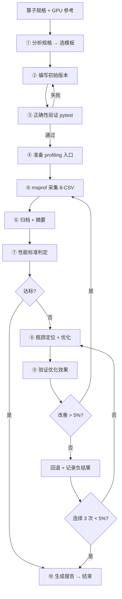

# 第 6 篇：Agent 自动化算子开发与优化闭环

> **定位**：将前 5 篇的方法论和优化技术自动化。读完本篇，读者能用 Agent 工具链自动开发优化算子。
>
> **知识边界**：
> - ✅ 本篇讲：10 步闭环实操、msprof 采集命令、Skill 体系、CI/CD 集成、Agent prompt
> - ❌ 本篇不讲：优化策略（→ 第 5 篇）、API 签名（→ 第 2 篇）、模板代码（→ 第 4 篇）
>
> **前置**：第 1 篇（方法论）+ 第 4 篇（模板）+ 第 5 篇（极致优化）

---

## 6.1 整体方案

### 6.1.1 目标

给定算子规格 + GPU 参考实现，**自动生成 NPU 高性能实现**。

```
输入                          输出
┌──────────────────┐         ┌──────────────────┐
│ 算子规格          │         │ NPU TileLang 算子 │
│ GPU 参考实现      │  ──→   │ 性能报告          │
│ 关键维度          │  Agent  │ 正确性验证        │
│ SSH 配置          │         │ 负结果记录        │
└──────────────────┘         └──────────────────┘
```

### 6.1.2 架构

```
┌──────────────────────────────────────────────────────────┐
│                    Agent 自动化架构                       │
│                                                          │
│  ┌──────────┐  ┌──────────┐  ┌──────────┐  ┌──────────┐ │
│  │  Agent   │  │  Skill   │  │  Tools   │  │ Method   │ │
│  │  (LLM)   │  │ (领域知识)│  │(msprof等)│  │(10步闭环)│ │
│  └────┬─────┘  └────┬─────┘  └────┬─────┘  └────┬─────┘ │
│       │              │              │              │       │
│  ┌────▼──────────────▼──────────────▼──────────────▼────┐│
│  │              10 步闭环执行引擎                        ││
│  │  分析→编写→验证→采集→诊断→优化→验证→报告            ││
│  └───────────────────────────────────────────────────────┘│
└──────────────────────────────────────────────────────────┘
```

### 6.1.3 核心流程图



### 6.1.4 关键设计

- **人在回路（Human-in-the-loop）**：Agent 自动执行，关键决策点人工确认
- **与前 5 篇的关系**：
  - 第 1 篇方法论 → Agent 的 10 步闭环骨架
  - 第 4 篇模板 → Agent 的初始实现参考
  - 第 5 篇极致优化 → Agent 的策略库

---

## 6.2 方案细节与规格

### 6.2.1 输入规格

```yaml
算子名: per_token_cast_to_fp8
参考实现: gpu_reference.py
关键维度: [4096, 8192, 12288]
GPU kernel: per_token_cast_cuda.py
SSH 配置: {host: 10.x.x.x, user: ...}
skill 路径: .agents/skills/tilelang-ascend/
约束:
  - GPU kernel 不修改
  - 代码长度 ≤ GPU kernel 2x
  - 中文交付
```

### 6.2.2 10 步闭环详解

| 步骤 | 内容 | 引用前文 | 工具 | 输出 |
|------|------|---------|------|------|
| ① 分析算子规格 | 语义/shape/dtype/访问模式 → 选模板 A~F | → 第 4 篇 § 4.0 | LLM | 模板选择 + tiling 策略 |
| ② 编写初始版本 | 设 pass_configs、tiling、执行模型、边界保护 | → 第 2 篇 § 2.1-2.9 | LLM | TileLang kernel 源码 |
| ③ 正确性验证 | ssh sync + pytest | — | ssh_remote.py | pass/fail |
| ④ 准备 profiling 入口 | 生成独立 profiling_file，触发 JIT 确认 kernel 名 | → 第 2 篇 § 2.9 | LLM | profiling 脚本 |
| ⑤ msprof op 采集 | 普通采集 + PipeTimeline 采集（两次独立） | → § 6.3.1 | msprof | 8-CSV + timeline |
| ⑥ 归档 + 摘要 | perf_summary.py 生成 summary.txt | — | perf_summary.py | 归档目录 |
| ⑦ 性能标准判定 | 8-CSV 联合诊断 + 搬运/计算量核算 | → 第 1 篇 § 1.3 + 第 5 篇 | LLM | 瓶颈分析 |
| ⑧ 瓶颈定位优化 | 查 optimization_quickref.md + 瓶颈对照表 | → 第 1 篇 § 1.2 + 第 5 篇 | LLM | 优化方案 |
| ⑨ 验证优化效果 | 对比 round_NNN，每次只改一个变量 | → 第 1 篇 § 1.4 | diff | 性能对比 |
| ⑩ 生成 HTML 报告 | 含前后对比、GPU 对比、负结果记录 | — | report.py | HTML 报告 |

### 6.2.3 步骤 ① 详解：分析算子规格

```
输入：算子语义 + shape + dtype + 访问模式
  ↓
分析：
  - 计算类型？（GEMM/归约/gather/选择/elementwise）
  - 访问模式？（连续/不规则/逐元素）
  - 引擎需求？（Cube/Vector/混合）
  ↓
输出：模板选择（A~F）+ tiling 策略
  ↓
引用：第 4 篇 § 4.0 选型决策树
```

### 6.2.4 步骤 ⑦ 详解：性能标准判定

```
读取 OpBasicInfo.csv → Task Duration, Block Dim
  ↓
读取 PipeUtilization.csv → 主导流水单元
  ↓
核算实际搬运数据量 + 实际运算数据量
  ↓
计算理论耗时（搬运量/带宽 或 计算量/算力）
  ↓
比较实际耗时 vs 理论耗时
  ├── 差距 < 20% → 性能达标
  ├── 差距 20-50% → 有优化空间
  └── 差距 > 50% → 严重瓶颈
  ↓
引用：第 1 篇 § 1.3（8-CSV 概念）+ 第 5 篇（策略选择）
```

### 6.2.5 步骤 ⑧ 详解：瓶颈定位优化

```
确认瓶颈类型（MTE2/VEC/CUBE/SCALAR/...）
  ↓
查 optimization_quickref.md
  ↓
查瓶颈对照表（→ 第 1 篇 § 1.2）
  ↓
制定具体优化方案（API 修改 + 参数调整）
  ↓
引用：第 5 篇 § 5.1-5.6（L0-L4 策略库）
```

### 6.2.6 迭代终止条件

| 条件 | 含义 | 典型场景 |
|------|------|---------|
| 带宽 > 60% | 接近硬件极限 | MTE2 bound 算子 |
| 实际 vs 理论差距 < 20% | 接近理论最优 | 计算密集型 |
| 连续 3 次 < 5% 改善 | 边际收益递减 | 已过主要优化点 |
| 编译失败 | 参数不合法 | 回退该参数 |

### 6.2.7 Agent Prompt 模板

```markdown
# 算子优化任务

## 算子规格
- 名称：{op_name}
- 语义：{semantics}
- shape：{shapes}
- dtype：{dtypes}

## GPU 参考实现
{gpu_code}

## 约束
- 不修改 GPU kernel
- 代码长度 ≤ GPU kernel 2x
- 中文交付

## 执行步骤
1. 分析算子规格，选择模板（→ 第 4 篇 § 4.0）
2. 编写初始版本（→ 第 2 篇 API）
3. 正确性验证
4. msprof 采集（→ § 6.3）
5. 瓶颈诊断（→ 第 1 篇 § 1.3）
6. 优化（→ 第 5 篇策略库）
7. 验证 + 迭代
8. 生成报告

## 所需工具
- ssh_remote.py（远程执行）
- msprof（性能采集）
- perf_summary.py（摘要生成）
- pytest（正确性验证）
```

---

## 6.3 msprof 采集与 8-CSV 联合诊断实操

> 第 1 篇 § 1.3 介绍了 8-CSV 的概念和分析顺序。本节展开完整实操流程。

### 6.3.1 采集命令

#### 普通采集

```bash
msprof --application="python3 profiling_file.py" \
       --output=$OPPROF_DIR \
       --aic-metrics=PipeUtilization,ArithmeticUtilization,Memory,MemoryL0,MemoryUB,L2Cache,ResourceConflictRatio \
       --aic-only \
       --force
```

#### PipeTimeline 采集

```bash
msprof --application="python3 profiling_file.py" \
       --output=$OPPROF_DIR_PIPE \
       --aic-metrics=PipeUtilization,ArithmeticUtilization,Memory,MemoryL0,MemoryUB,L2Cache,ResourceConflictRatio \
       --aic-pipetimeline=on \
       --aic-only \
       --force
```

#### 两次独立采集

- **普通采集**：用于瓶颈定位（8-CSV 分析）
- **PipeTimeline 采集**：用于流水线时序分析（气泡/重叠）
- **必须两次独立**：避免互相干扰

### 6.3.2 8-CSV 读取与分析

> 固定读取顺序 → 第 1 篇 § 1.3 定义了顺序和分析目标

```
1. OpBasicInfo.csv        → 校验 kernel 名/频率/Task Duration
2. PipeUtilization.csv    → 主导流水/核间差异
3. ArithmeticUtilization.csv → 有效计算/指令结构
4. Memory.csv             → 总搬运量/带宽利用率
5. MemoryL0.csv           → CUBE L0A/L0B/L0C 带宽
6. MemoryUB.csv           → Vector UB 读写带宽
7. L2Cache.csv            → 缓存命中假设验证
8. ResourceConflictRatio.csv → Bank conflict/等待比例
```

### 6.3.3 联合诊断实操：per_token_cast g32

```
① OpBasicInfo:
   Task Duration = 151 us
   Block Dim = 64

② PipeUtilization:
   aiv_vec_ratio = 79%
   aiv_mte2_ratio = 97%      ← MTE2 占用最高

③ ArithmeticUtilization:
   vector_fma_ratio = 72%

④ Memory:
   GM_to_UB = 27 GB/s per core (峰值 64 GB/s, 42%)

⑤ MemoryL0:
   (非 Cube 算子，L0 数据无意义)

⑥ MemoryUB:
   UB read = 45 GB/s
   UB write = 12 GB/s

⑦ L2Cache:
   total_hit_rate = 78%

⑧ ResourceConflictRatio:
   vec_wait_ratio = 82%
   mte2_wait_ratio = 97%     ← MTE2 等待最高

结论：MTE2 带宽瓶颈，硬件极限
→ 第 5 篇 § 5.8.4 详细分析
```

### 6.3.4 交叉关联诊断

| 现象组合 | 根因假设 | 优先检查 |
|---------|---------|---------|
| 高 vec + 高 bank conflict | UB 布局放大 Vector 耗时 | `alloc_shared` shape/padding |
| 高 mte2 + 低 L2 hit | 数据复用或 L2 策略不合理 | Tile 调度、`l2_cache_ctrl` |
| 高 fixpipe | 输出路径低效 | 输出 Tile、`dual_copy` 路径 |
| 高 mte2 + 高 mte3 | GM 双向搬运饱和 | 融合中间结果、增大 Tile |

### 6.3.5 归档目录结构

```
<variant_output_dir>/docs/perf/
├── round_001/                    # 基线
│   ├── OpBasicInfo.csv           # 8 个原始 CSV
│   ├── PipeUtilization.csv
│   ├── ArithmeticUtilization.csv
│   ├── Memory.csv
│   ├── MemoryL0.csv
│   ├── MemoryUB.csv
│   ├── L2Cache.csv
│   ├── ResourceConflictRatio.csv
│   ├── summary.txt               # 统计摘要
│   └── pipe_timeline/            # PipeTimeline 时序数据
├── round_002/                    # 优化后
│   └── ...
└── round_NNN/                    # 第 N 轮优化
    └── ...
```

### 6.3.6 Agent 10 步闭环代码实现

以下展示 10 步闭环中关键步骤的**实际代码实现**：

#### 步骤 ① 分析算子规格（Agent 自动分析）

```python
# Agent 分析算子规格的 prompt
analyze_prompt = f"""
分析以下算子规格，选择模板并制定 tiling 策略：

算子名: {op_name}
语义: {semantics}
shape: {shapes}
dtype: {dtypes}
访问模式: {access_pattern}

可选模板:
  A: Gather/Vector (MTE2+SimtVF)
  B: GEMM/Cube (Cube+MTE2)
  C: Flash Attention (Cube+SimdVF)
  D: 归约/Norm (SimdVF)
  E: 量化/Cast (SimdVF)
  F: TopK/选择 (SimdVF)

输出: 模板选择 + tiling 策略 + pass_configs
"""
# Agent 输出示例:
# {"template": "E", "tiling": {"BM": 8, "BN": "auto"}, "pass_configs": ["fast_math", "disable_vectorize"]}
```

#### 步骤 ② 编写初始版本（Agent 生成代码）

```python
# Agent 生成初始 kernel 代码
initial_kernel = """
import tilelang
from tilelang.language import *

@tilelang.jit(pass_configs={
    tilelang.PassConfigKey.TIR_DISABLE_VECTORIZE: True,
    tilelang.PassConfigKey.TL_DISABLE_DATA_RACE_CHECK: True,
    tilelang.PassConfigKey.TL_ENABLE_FAST_MATH: True,
})
def per_token_cast_kernel(M, N, dtype="bfloat16"):
    BM = 8
    BN = 16384  # 自适应
    num_cores = 64

    @T.prim_func
    def main(x: T.Buffer((M, N), dtype), out: T.Buffer((M, N//2), "float8_e4m3")):
        with T.Kernel(num_cores) as pid:
            # ... 初始实现
    return main
"""
```

#### 步骤 ③ 正确性验证（远程执行）

```python
# ssh_remote.py 正确性验证
def verify_correctness(remote, kernel_file, test_file):
    # 同步代码到远程
    remote.sync(local_dir="./src", remote_dir="~/workspace/src")

    # 执行 pytest
    result = remote.exec(f"cd ~/workspace && python3 -m pytest {test_file} -v")

    # 解析结果
    if "PASSED" in result.stdout:
        return True, "正确性验证通过"
    else:
        return False, result.stdout
```

#### 步骤 ⑤ msprof 采集（两次独立）

```python
# Agent 自动执行 msprof 采集
def msprof_collect(remote, profiling_file, output_dir):
    # 普通采集
    cmd_normal = f"""
    msprof --application="python3 {profiling_file}" \\
           --output={output_dir}/normal \\
           --aic-metrics=PipeUtilization,ArithmeticUtilization,Memory,MemoryL0,MemoryUB,L2Cache,ResourceConflictRatio \\
           --aic-only --force
    """
    remote.exec(cmd_normal)

    # PipeTimeline 采集（独立执行）
    cmd_pipe = f"""
    msprof --application="python3 {profiling_file}" \\
           --output={output_dir}/pipe \\
           --aic-metrics=PipeUtilization,ArithmeticUtilization,Memory,MemoryL0,MemoryUB,L2Cache,ResourceConflictRatio \\
           --aic-pipetimeline=on \\
           --aic-only --force
    """
    remote.exec(cmd_pipe)

    return f"{output_dir}/normal", f"{output_dir}/pipe"
```

#### 步骤 ⑦ 性能标准判定（8-CSV 联合诊断）

```python
# Agent 自动诊断瓶颈
def diagnose_bottleneck(csv_dir):
    # 按 8-CSV 固定顺序读取
    op_basic = read_csv(f"{csv_dir}/OpBasicInfo.csv")
    pipe_util = read_csv(f"{csv_dir}/PipeUtilization.csv")
    memory = read_csv(f"{csv_dir}/Memory.csv")
    resource = read_csv(f"{csv_dir}/ResourceConflictRatio.csv")

    # 提取关键指标
    task_duration = op_basic["Task Duration"]
    mte2_ratio = pipe_util["aiv_mte2_ratio"]
    vec_ratio = pipe_util["aiv_vec_ratio"]
    scalar_ratio = pipe_util["aiv_scalar_ratio"]
    mte2_wait = resource["mte2_wait_ratio"]
    bandwidth = memory["bandwidth_util"]

    # 瓶颈判定逻辑
    if mte2_ratio > 95 and mte2_wait > 95:
        return {"bottleneck": "MTE2_HW_LIMIT", "action": "terminate", "reason": "硬件极限"}
    elif scalar_ratio > 30:
        return {"bottleneck": "SCALAR_OVERHEAD", "action": "optimize", "strategy": "批量化+特化"}
    elif vec_ratio > 80 and has_scalar_gm_read:
        return {"bottleneck": "VEC_SCALAR_READ", "action": "optimize", "strategy": "T.copy DMA 替换"}
    # ... 其他判定
```

#### 步骤 ⑧ 瓶颈定位优化（查策略表）

```python
# Agent 查策略表并生成优化方案
def generate_optimization(bottleneck, current_kernel):
    # 查 optimization_quickref.md
    strategy = lookup_strategy(bottleneck)

    # 生成优化代码
    optimization_prompt = f"""
当前瓶颈: {bottleneck}
推荐策略: {strategy}
当前代码: {current_kernel}

请根据策略修改代码，每次只改一个主要变量。
输出: 修改后的代码 + 修改说明
"""
    optimized_kernel = agent.generate(optimization_prompt)
    return optimized_kernel
```

### 6.3.7 Agent 迭代优化完整日志

以下是一个完整的 Agent 迭代优化日志（per_token_cast 算子）：

```
========== Agent 优化任务启动 ==========
算子: per_token_cast_to_fp8
目标: NPU Ascend 950B
初始延迟: 201.9 us, 带宽: 49%

--- Round 001 (基线) ---
Step ①: 分析规格 → 模板 E (量化/Cast)
Step ②: 编写初始版本 → pass_configs: fast_math + disable_vectorize
Step ③: 正确性验证 → ✅ PASSED
Step ⑤: msprof 采集 → mte2=95%, vec=85%
Step ⑦: 性能判定 → 带宽 49% < 60%，需优化
Step ⑧: 瓶颈定位 → MTE2 + VEC 双高

--- Round 002 (R1: num_stages=3) ---
Step ⑧: 策略 → L3 流水深度
Step ⑨: 验证 → 185us, 54% ✅ 改善 8.4%
Step ⑥: 归档 → round_002/

--- Round 003 (R2: UB-aware num_sf_slots) ---
Step ⑧: 策略 → L4 编译期调优
Step ⑨: 验证 → 175us, 58% ✅ 改善 5.4%
Step ⑥: 归档 → round_003/

--- Round 004 (R3: PassConfig) ---
Step ⑧: 策略 → L4 PassConfig
Step ⑨: 验证 → 168us, 61% ✅ 改善 4.0%
Step ⑥: 归档 → round_004/

--- Round 005 (R4: vand 替代 vabs) ---
Step ⑧: 策略 → L0 指令替换
Step ⑨: 验证 → 162us, 63% ✅ 改善 3.6%
Step ⑥: 归档 → round_005/

--- Round 006 (R5: 自适应 packed_row_block_k) ---
Step ⑧: 策略 → L1 算法级
Step ⑨: 验证 → 158us, 64% ✅ 改善 2.5%
Step ⑥: 归档 → round_006/

--- Round 007 (R6: vld2+vcgmax bf16 归约) ---
Step ⑧: 策略 → L0 指令融合
Step ⑨: 验证 → 151.1us, 66% ✅ 改善 4.4%
Step ⑥: 归档 → round_007/

--- Round 008 (R7: num_stages=4 g32) ---
Step ⑧: 策略 → L3 流水深度
Step ⑨: 验证 → 151.3us, 66% ✅ 改善 0.1%
Step ⑥: 归档 → round_008/

--- Round 009 (R8: 5 个尝试) ---
Step ⑧: 尝试 1: vld2 in quantize → ❌ 回退
Step ⑧: 尝试 2: 融合 reduce+quantize → ❌ 回退
Step ⑧: 尝试 3: 32 cores → ❌ 回退
Step ⑧: 尝试 4: L2 bypass → ❌ 回退
Step ⑧: 尝试 5: group_size=2 → ❌ 回退

--- 终止判定 ---
mte2_ratio = 97% > 95% → 硬件极限
连续 5 次无效 → 边际收益递减

--- Step ⑩ 生成报告 ---
最终: 201.9us → 151.3us (1.34x), 带宽 49% → 66%
瓶颈: MTE2 97% → HBM 带宽硬件极限
负结果: 5 条已记录
========== 任务完成 ==========
```

---

## 6.4 操作手册

### 6.4.1 环境准备

```bash
# Ascend 驱动 + CANN
source /usr/local/Ascend/ascend-toolkit/set_env.sh

# conda 环境
conda activate tilelang

# msprof 路径
export PATH=$PATH:/usr/local/Ascend/ascend-toolkit/latest/tools/profiler/bin
```

### 6.4.2 远程执行

```python
# ssh_remote.py 使用
from ssh_remote import SSHRemote

remote = SSHRemote(host="10.x.x.x", user="user")

# 同步代码
remote.sync(local_dir="./src", remote_dir="~/workspace/src")

# 执行命令
remote.exec("cd ~/workspace && python3 test.py")

# 运行 benchmark
result = remote.run("python3 -m pytest --run-benchmark")

# 采集 msprof
remote.bench("msprof --application=...")
```

### 6.4.3 正确性测试

```bash
# pytest 模板
python3 -m pytest test_per_token_cast.py -v

# 带 benchmark
python3 -m pytest test_per_token_cast.py --run-benchmark -v
```

### 6.4.4 性能摘要生成

```bash
# perf_summary.py
python3 {skill_path}/scripts/perf_summary.py $OPPROF_DIR <variant_output_dir> \
  --kernel-name <expected_kernel> --round-name <case_or_round_name>
```

`perf_summary.py` 自动完成：
1. 创建归档目录
2. 复制 8 个 CSV 原始文件
3. 校验 kernel 名唯一匹配
4. 生成 `summary.txt` 统计摘要

### 6.4.5 对比验证

```bash
# 对比两轮摘要
diff <variant>/docs/perf/round_001/summary.txt \
     <variant>/docs/perf/round_002/summary.txt
```

**对比要点**：
1. Task Duration 是否下降
2. 瓶颈单元的 ratio 是否改善
3. 核间均衡是否改善
4. 是否引入新瓶颈

---

## 6.5 Skill 体系

### 6.5.1 tilelang-ascend SKILL.md（核心 skill）

780 行，包含 12 节内容：

| 节 | 内容 | 对应篇 |
|----|------|-------|
| 1. Mental Model | Ascend vs CUDA 对比 | 第 1 篇 |
| 2. Thread Hierarchy | Kernel launch + SimtVF + SimdVF | 第 2 篇 § 2.6 |
| 3. Core Architecture | AIC/AIV 双核 | 第 1 篇 |
| 4. Memory Hierarchy | 6 级内存 | 第 2 篇 § 2.2 |
| 5. GEMM Constraints | transpose_B + L1 + L0C | 第 2 篇 § 2.5 |
| 6. Data Movement | T.copy + T.dual_copy | 第 2 篇 § 2.4 |
| 7. Synchronization | flag/buf 同步 | 第 5 篇 § 5.4.3 |
| 8. SIMD MicroAPI | vld/vsts/vadd... | 第 2 篇 § 2.7 |
| 9. Programming Patterns | 6 个模式 | 第 4 篇 |
| 10. Common Pitfalls | 11 条陷阱 | 第 1 篇 § 1.4.4 |
| 11. Compilation | pass + PassConfig | 第 3 篇 |
| 12. Example Reference | 文件路径速查 | 附录 A |

### 6.5.2 6 个编程模式

| 模式 | 对应模板 | 核心引擎 |
|------|---------|---------|
| GEMM | B | Cube + MTE2 |
| Vector | A | MTE2 + SimtVF |
| Mixed | C | Cube + SimdVF |
| Reduction | D | SimdVF + Reducer |
| Cast | E | SimdVF + SIMD |
| Gather | A | MTE2 + SimtVF |

### 6.5.3 11 条常见陷阱

| 陷阱 | 说明 | 正确做法 |
|------|------|---------|
| threads= on T.Kernel | Ascend 不支持 | 用 T.SimtVF(threads=N) |
| transpose_B=False | Cube 要求 | transpose_B=True |
| 忽略 NZ 布局 | Cube 输入需 NZ | InsertNd2Nz pass 处理 |
| 标量 GM 读 | 10x+ 慢 | 用 T.copy DMA |
| UB 超容 | > 256KB | 减小 tile 或 num_stages |
| ... | ... | ... |

### 6.5.4 其他 Skill

| Skill | 内容 |
|-------|------|
| `tilelang-build` | 构建/安装/测试 |
| `tilelang-cpp-style` | C++ 代码风格 |
| `tilelang-tvm-ir` | TVM IR Handle 约定 |
| `ops-profiling` | 6 步 profiling 流程 |

### 6.5.5 Skill 调用方式

```python
# Agent 加载 skill
skill = load_skill("tilelang-ascend")
# skill 内容注入 Agent 上下文

# Agent 使用 skill 知识
# → 选择模板
# → 设置 PassConfig
# → 避免 11 条陷阱
```

---

## 6.6 CI/CD 集成

### 6.6.1 PR 回归测试

```yaml
# pr-regression-test-bot-ascend.yml
name: Ascend PR Regression Test
on: [pull_request]

jobs:
  benchmark:
    runs-on: ascend-runner
    steps:
      - uses: actions/checkout@v3
      - name: Run benchmark
        run: |
          python3 -m pytest --run-benchmark \
            --benchmark-baseline=benchmark_baselines.jsonl
      - name: Check regression
        run: |
          python3 scripts/check_regression.py \
            --threshold=5%
```

### 6.6.2 性能基线管理

```jsonl
// benchmark_baselines.jsonl
{"op": "rmsnorm", "shape": "4096,7168", "latency_us": 165, "bandwidth_pct": 88}
{"op": "gather", "shape": "128,4096", "latency_us": 87, "bandwidth_pct": 39}
{"op": "per_token_cast", "shape": "4096,8192", "latency_us": 151, "bandwidth_pct": 66}
```

### 6.6.3 自动回归检测

```python
# pytest_benchmark_plugin.py
# - GPU memory 分类：HBM / UB / L1
# - 阈值检测：5% 回归自动标注
# - improvements / regressions 自动评论
```

### 6.6.4 阈值与告警

| 指标 | 阈值 | 动作 |
|------|------|------|
| 延迟回归 | > 5% | 自动标注 ⚠️ |
| 带宽下降 | > 5% | 自动标注 ⚠️ |
| 延迟改善 | > 5% | 自动标注 ✅ |
| 编译失败 | — | 阻止合并 ❌ |

---

## 6.7 实战案例：per_token_cast 优化全过程

### 6.7.1 Agent 决策日志

```
Step ①: 分析算子规格
  - 语义：per-token amax → scale → FP8 cast
  - shape: [M, N] → [M, N/2] (fp8 packed)
  - 访问模式：连续行 + 归约
  → 选择模板 E (量化/Cast)

Step ②: 编写初始版本
  - pass_configs: fast_math + disable_vectorize + disable_race_check
  - tiling: BM=8, BN=自适应
  - 执行模型: SimdVF
  → 生成初始 kernel（201.9 us, 49% 带宽）

Step ③: 正确性验证
  → pytest allclose pass

Step ⑤: msprof 采集
  → aiv_mte2_ratio = 95%, aiv_vec_ratio = 85%

Step ⑦: 性能判定
  - 带宽 49% < 60% → 需优化
  - 瓶颈：MTE2 + VEC 双高

Step ⑧: 瓶颈定位 → 优化
  R1: num_stages=3 (L3)      → ✅
  R2: UB-aware num_sf_slots (L4) → ✅
  R3: PassConfig (L4)         → ✅
  R4: vand 替代 vabs (L0)    → ✅
  R5: 自适应 packed_row_block_k (L1) → ✅
  R6: vld2+vcgmax bf16 归约 (L0) → ✅ 151.1 us, 66%
  R7: num_stages=4 g32 (L3)  → ✅
  R8: 5 个尝试              → ❌ 全部回退

Step ⑩: 生成报告
  → 1.34x 加速, 66% 带宽, MTE2 硬件极限
```

### 6.7.2 负结果记录

| 尝试 | 结果 | 原因 |
|------|------|------|
| vld2 in quantize | ❌ | 瓶颈是延迟非指令数 |
| 融合 reduce+quantize | ❌ | MTE2 流量不变 |
| 32 cores | ❌ | 并行度减半 |
| L2 bypass | ❌ | L2 非瓶颈 |
| group_size=2 | ❌ | 大 tile 窃取无益 |

### 6.7.3 最终结论

- 从基线 201.9us 到优化后 151.3us (1.34x)
- 带宽 49% → 66%
- 最终瓶颈：MTE2 97% → HBM 带宽硬件极限
- 技术细节 → 详见第 5 篇 § 5.8

---

## 6.8 Agent 调试与故障排查

### 6.8.1 常见故障及排查流程

```
Agent 执行异常
  ├─ 步骤 ③ 正确性验证失败
  │   ├─ 数值不匹配 → 检查 kernel 逻辑
  │   │   ├─ shape 不匹配 → 检查 tiling 边界
  │   │   ├─ dtype 不匹配 → 检查 cast 逻辑
  │   │   └─ 计算错误 → 对比 GPU 参考实现
  │   └─ 编译失败 → 检查 PassConfig
  │       ├─ UB 超容 → 减小 tile 或 num_stages
  │       ├─ 不支持的 API → 查第 2 篇 API 列表
  │       └─ NZ 布局错误 → 加 InsertNd2Nz pass
  │
  ├─ 步骤 ⑤ msprof 采集失败
  │   ├─ msprof 未找到 → 检查 PATH 环境变量
  │   ├─ 权限不足 → 检查 NPU 设备权限
  │   └─ CSV 为空 → 检查 kernel 名是否匹配
  │
  ├─ 步骤 ⑦ 诊断结果异常
  │   ├─ ratio 全为 0 → kernel 未执行
  │   ├─ Task Duration 异常大 → 可能有死锁
  │   └─ 带宽 > 100% → 采集配置错误
  │
  └─ 步骤 ⑨ 优化后性能回退
      ├─ 回退到上一轮 → 记录负结果
      ├─ 编译失败 → 回退 + 记录
      └─ 正确性失败 → 回退 + 记录
```

### 6.8.2 常见故障清单

| 故障 | 现象 | 原因 | 解决方案 |
|------|------|------|---------|
| **UB 超容** | 编译报错 `UB size exceeds limit` | `BD × dtype × num_stages > 256KB` | 减小 BD 或 num_stages |
| **kernel 名不匹配** | msprof CSV 为空 | profiling_file 中 kernel 名与实际不符 | 检查 `TL_ENABLE_DUMP_IR` 确认 kernel 名 |
| **NZ 布局错误** | 编译失败或结果错误 | Cube 输入未转 NZ 布局 | 加 `InsertNd2Nz` pass 或用 `T.copy` 自动转换 |
| **数据竞争** | 结果随机错误 | 多线程写同一 UB 区域 | 加 `TL_DISABLE_DATA_RACE_CHECK` 或修复同步 |
| **正确性不匹配** | `torch.allclose` 失败 | 计算逻辑或 cast 模式错误 | 逐行对比 GPU 参考实现 |
| **msprof 权限不足** | `Permission denied` | NPU 设备权限 | `sudo usermod -aG HwHiAiUser $USER` |
| **SSH 连接失败** | `Connection refused` | 远程机器未启动或网络问题 | 检查网络 + 重启 NPU 服务 |
| **性能回退** | 优化后延迟增大 | 参数不合法或引入新瓶颈 | 回退 + 记录负结果 |

### 6.8.3 调试工具与技巧

#### IR Dump 调试

```bash
# 启用 IR dump 查看编译过程
export TL_ENABLE_DUMP_IR=1
export TL_DUMP_IR_DIR=./ir_dump

# 查看各 pass 前后的 IR
ls ./ir_dump/
# before_z3_schedule.tir
# after_z3_schedule.tir
# before_codegen.tir
# final_code.cc
```

#### JIT 调试模式

```python
# 启用 JIT 调试
import tilelang
tilelang.set_debug_mode(True)

# 编译时打印详细信息
kernel = tilelang.jit(debug=True)(my_kernel)
# → 打印: pass pipeline, tiling, UB usage, ...
```

#### 逐轮对比调试

```bash
# 对比两轮的 IR 差异
diff round_001/ir_dump/after_z3_schedule.tir \
     round_002/ir_dump/after_z3_schedule.tir

# 对比两轮的 summary
diff round_001/summary.txt round_002/summary.txt
```

### 6.8.4 Agent 优化效率优化

| 场景 | 传统人工 | Agent 自动化 | 加速比 |
|------|---------|------------|-------|
| 简单算子（Gather/RoPE） | 2-4 小时 | 0.5-1 小时 | 4-8x |
| 中等算子（RMSNorm/Softmax） | 1-2 天 | 2-4 小时 | 6-12x |
| 复杂算子（Flash Attention） | 3-5 天 | 4-8 小时 | 6-15x |
| 极复杂算子（MLA/NSA） | 1-2 周 | 1-2 天 | 7-14x |

**Agent 优势来源**：
1. **Skill 知识库**：780 行 SKILL.md 提供领域知识，避免低级错误
2. **策略表**：9 类瓶颈 × 策略映射，自动选择优化方向
3. **负结果记录**：避免重复踩坑
4. **24/7 不间断**：无需人工休息，持续迭代

### 6.8.5 人在回路（Human-in-the-Loop）设计

```
Agent 自动执行
    ↓
关键决策点 → 人工确认
    ├─ 模板选择 → 人工确认（防止选错模板）
    ├─ 优化方向 → 人工确认（防止无效方向）
    ├─ 终止判定 → 人工确认（防止过早终止）
    └─ 负结果 → 自动记录（无需人工）
    ↓
人工确认后继续
```

| 决策点 | 自动/人工 | 原因 |
|--------|---------|------|
| 模板选择 | 人工确认 | 选错模板浪费大量时间 |
| 代码编写 | 自动 | 基于 Skill 和模板 |
| 正确性验证 | 自动 | pytest 自动执行 |
| 优化方向 | 人工确认 | 防止无效方向 |
| 参数调整 | 自动 | 基于策略表 |
| 终止判定 | 人工确认 | 防止过早终止 |
| 报告生成 | 自动 | 自动汇总 |

---

## 6.9 读者检查点

1. **10 步闭环中，每步分别引用前 5 篇的哪些知识点？**
   - ①→第 4 篇模板, ②→第 2 篇 API, ⑦→第 1 篇 8-CSV+第 5 篇策略, ⑧→第 1 篇策略表+第 5 篇 L0-L4

2. **msprof 普通采集和 PipeTimeline 采集有什么区别？为什么要两次独立采集？**
   - 普通：8-CSV 瓶颈定位；PipeTimeline：流水气泡分析
   - 两次独立避免互相干扰

3. **8-CSV 的固定读取顺序是什么？为什么按这个顺序？**
   - OpBasicInfo → PipeUtilization → ... → ResourceConflict
   - 从全局到局部：先校验基本信息，再定位主导引擎，最后分析具体冲突

4. **Agent 如何选择模板 A~F？依据是什么？**
   - 分析算子语义/shape/dtype/访问模式 → 查选型决策树（第 4 篇 § 4.0）

5. **迭代终止条件有哪四个？分别对应什么场景？**
   - 带宽>60%（硬件极限）/ 差距<20%（理论最优）/ 连续3次<5%（边际递减）/ 编译失败（回退）

---

## 6.10 小结

本篇介绍了 TileLang 算子开发的 Agent 自动化闭环：

| 组件 | 内容 |
|------|------|
| 10 步闭环 | 分析→编写→验证→采集→诊断→优化→验证→报告 |
| Skill 体系 | tilelang-ascend (780行) + 4 个辅助 skill |
| msprof 实操 | 采集命令 + 8-CSV 分析 + 归档 |
| CI/CD | PR 回归 + 基线管理 + 自动告警 |

**核心结论**：
- Agent 自动化 = 10 步闭环 + Skill 领域知识 + msprof 诊断 + 闭环验证
- 将算子开发效率提升 10x+（从数天到数小时）
- 负结果记录避免重复踩坑

下一篇将展示整网训练中的应用。
